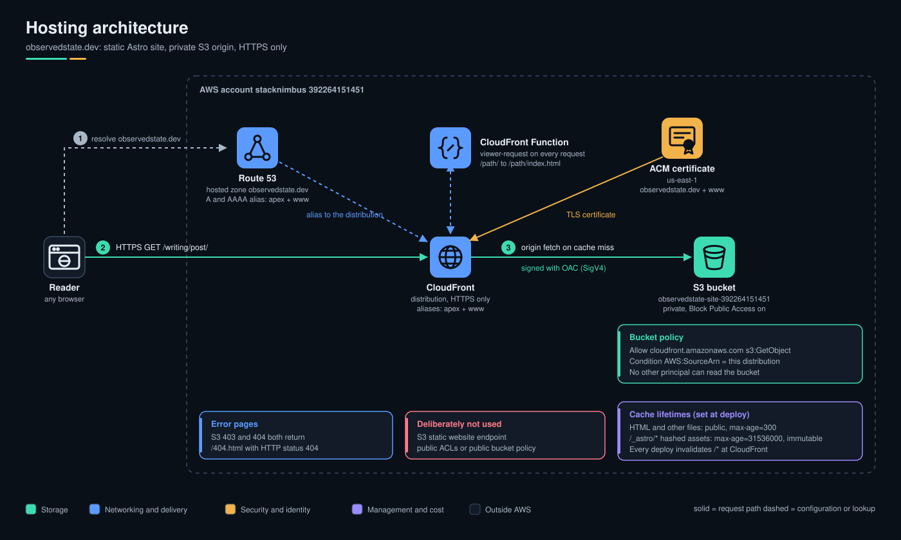

# observedstate.dev

Source for [observedstate.dev](https://observedstate.dev): ServiceNow ITOM and the CMDB at the center, with cloud, infrastructure as code, monitoring and data integrations around it, and the learning paths between them.

Built with [Astro](https://astro.build) (static output), hosted on S3 behind CloudFront, deployed by GitHub Actions over OIDC.

## First run

```bash
nvm use            # Node 22, see .nvmrc (anything >= 20.3 works)
npm install        # creates package-lock.json: commit it, the deploy workflow uses `npm ci`
npm run dev        # http://localhost:4321, drafts are visible here
npm run check      # type-check pages, components and content schemas
npm run build      # static site into dist/, drafts are excluded
```

> This scaffold was written without being able to install or build it. `npm run check` and `npm run build` on a real machine are the first test. Expect to fix a few small things. The package ranges are pinned to Astro 5.x.

## How the site is organized

Every piece of content is tagged with the same taxonomy, defined once in `src/data/taxonomy.ts`:

| Tag | Values | Becomes |
|---|---|---|
| `hub` | `cmdb`, `discovery`, `event-management`, `service-mapping`, `platform` | sections on `/hub/` |
| `spokes` | `cloud`, `iac`, `monitoring`, `data`, `automation-ai` | pages at `/spokes/<spoke>/` |
| `level` | `intro`, `practitioner`, `architect` | a label on each item |
| `format` | `field-note`, `deep-dive`, `teardown`, `reference`, `drift-log` | a label, and `/drift-log/` |

The schemas in `src/content.config.ts` are built from those lists, so a typo in frontmatter fails the build instead of creating a stray tag.

```
src/
  config.ts            site name, tagline, nav, author byline
  data/taxonomy.ts     the taxonomy above
  content.config.ts    schemas for the three collections
  content/
    writing/           posts          -> /writing/<slug>/
    patterns/          integration patterns, one template -> /patterns/<slug>/
    paths/             learning paths -> /paths/<slug>/
  pages/               routes (home, hub, spokes, writing, patterns, paths, drift-log, about, now, 404, rss.xml)
  components/          Header, Footer, HubMark, HubDiagram, PostCard, PatternCard, PathCard
  layouts/BaseLayout.astro
  styles/global.css    design tokens (dark "Signal", light "Daylight") and base styles
public/                favicons, social card, manifest, robots.txt
infra/                 cloudfront-rewrite.js (needed for directory URLs on S3)
docs/SETUP.md          the single setup runbook (AWS, GitHub, policies)
docs/*.drawio.svg       editable diagrams (draw.io): hosting, pipeline, accounts
.github/workflows/     build on PRs, build and deploy on main
```

## Adding content

Create a Markdown file in `src/content/writing/`. The filename becomes the URL.

```md
---
title: 'Discovery versus the Service Graph Connector for AWS'
description: 'One sentence, 200 characters at most.'
pubDate: 2026-11-02
hub: discovery
spokes: [cloud, data]
level: practitioner
format: deep-dive
draft: false
---

Body in Markdown.
```

- **Drafts:** `draft: true` shows the item in `npm run dev` only. All the seed files start as drafts, so nothing half-written ships. The production site stays mostly empty until you flip a few to `false`.
- **Patterns:** copy `src/content/patterns/aws-to-cmdb-sgc.md`, which doubles as the template. Keep the headings identical so every pattern reads the same way.
- **Paths:** each step has a `kind` (`read`, `build`, `cert`, `write`), an optional `note` and an optional `url`.
- **Now page:** edit the three lists at the top of `src/pages/now.astro`.
- **About page:** placeholder copy. Rewrite it, and decide what you want public.

## Deploying

See [docs/SETUP.md](docs/SETUP.md).



Deploy pipeline: [docs/pipeline-deploy.drawio.svg](docs/pipeline-deploy.drawio.svg). Account and permission fence: [docs/architecture-accounts.drawio.svg](docs/architecture-accounts.drawio.svg).

In short: S3 + CloudFront + ACM + Route 53 once, then every push to `main` deploys.

## Design

- Two colors carry the idea: **observed** state (teal, blue in light mode) and **desired** state (amber, rust in light mode).
- IBM Plex Sans for text and Plex Mono for labels, self-hosted through Fontsource, with no calls to Google Fonts.
- Light and dark follow the OS setting. There is no toggle.
